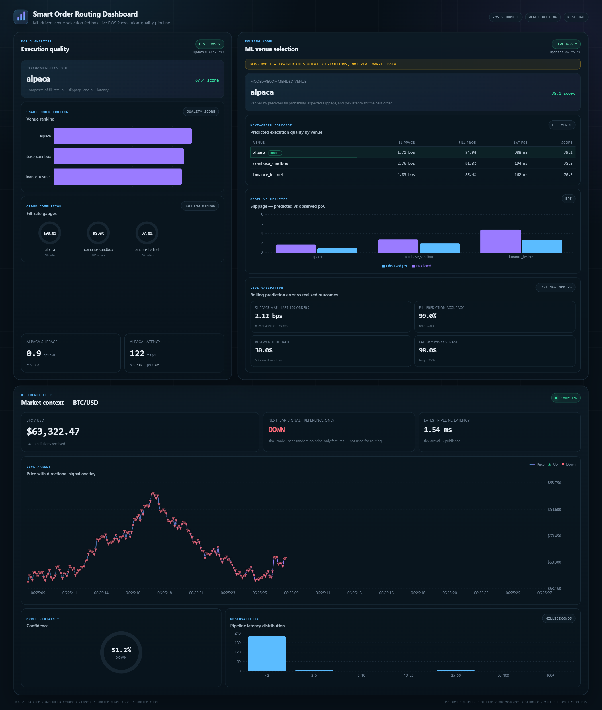

# Smart Order Routing Dashboard — ML-Driven Venue Selection

[](https://github.com/AdhritSingh21/smart-order-routing-dashboard/actions/workflows/ci.yml)

**ML-driven venue selection fed by a live ROS 2 execution-quality pipeline.**

A ROS 2 analyzer measures per-order execution quality (slippage, fill rate,
latency) across trading venues. A gradient-boosting model predicts each
venue's *next-order* execution quality from its rolling history, ranks the
venues into a smart-order-routing recommendation, and streams predictions —
with rolling live validation against realized outcomes — to a React dashboard
over WebSocket.



*Live run: observed venue metrics (left), the routing model's next-order
forecast with its `route` pick and rolling live validation (right), and the
clearly-labeled BTC/USD reference feed (bottom). The amber banner marks the
bundled demo model — trained on simulated executions, never presented as
production-quality.*

```
project_root/
├── exec_quality_ws/          ROS 2 Humble workspace — execution-quality analyzer
│                             (per-venue slippage / fill rate / latency) + dashboard_bridge
├── ai_viz_platform/          FastAPI backend: exec-quality ML (dataset → training →
│                             serving guard → live routing predictions) + React dashboard
├── dashboard_live_run.png    Screenshot of a live three-panel run
└── README.md                 This file
```

## What it does

```text
ROS 2 analyzer → dashboard_bridge → POST /ingest ─┬→ /ws → execution panel (observed metrics)
                                                  └→ routing model → /ws → routing panel
                                                     (predicted slippage / fill prob / latency
                                                      + recommendation + live validation)
market sim → ONNX inference → /ws → market-context panel (reference feed, de-emphasized)
```

- **Execution panel** — observed per-venue metrics from the ROS 2 analyzer:
  fill-rate gauges, venue ranking, slippage/latency percentile cards.
- **ML venue selection panel** — the routing model's *next-order* forecast per
  venue: expected slippage (bps), fill probability, p95 latency bound, and a
  composite routing score; the best venue is flagged **route**. A live
  validation strip tracks rolling slippage MAE (vs a naive recent-average
  baseline), fill-prediction accuracy/Brier, latency-bound coverage, and
  best-venue recommendation hit rate over the last 100 completed orders.
- **Market context panel** — the original BTC/USD price stream and next-bar
  signal, kept as a reference feed and explicitly labeled *near-random on
  price-only features — not used for routing*.

### Why execution-quality prediction (and not BTC direction)?

Next-bar crypto direction from price-only features is close to a coin flip,
and any dashboard claiming 80–95% accuracy there is misleading. Execution
quality is different: venue congestion and regime shifts are *persistent*,
so a venue's recent latency/slippage/fill history carries real signal about
its next order. The model's job is modest and measurable — beat the naive
"assume the venue's recent average" baseline — and every claim below is
validated on a strictly time-ordered held-out split plus rolling live
validation in the dashboard.

## Current evaluation results

The bundled model is trained on a **clearly labeled simulated replay**
(`data_source="simulated-replay"`, `is_demo=true` — no real logs exist yet in
this repo). Full report: `ai_viz_platform/models/exec_quality/EVAL_REPORT.md`.
Time-ordered 80/20 split, 29,970 rows, three venues:

| Target | Model | Naive baseline (recent venue average) |
|---|---|---|
| Slippage MAE (bps) | **2.73** | 3.00 (model −8.9%) |
| Fill probability ROC-AUC / Brier | **0.664 / 0.121** | 0.628 / 0.129 |
| Latency p95 bound coverage (target 0.95) | 0.91 at 258 ms mean bound | 0.94 at 374 ms mean bound |

These are deliberately unspectacular: an ~9% MAE edge over the baseline on
simulated data is what an honest execution model looks like, not 90%
"accuracy". The dashboard labels every prediction frame `model_status:
"demo"` until the model is retrained on real captured logs, and the backend
**refuses** to serve a demo model against a non-sim pipeline unless
`ALLOW_DEMO_EXEC_MODEL=true` is set explicitly.

## Prerequisites

- **Ubuntu 22.04** (native, WSL2, or Docker) — required for ROS 2.
- **ROS 2 Humble Hawksbill** — https://docs.ros.org/en/humble/Installation.html
- **Python 3.10+** (3.11 recommended) for the FastAPI backend.
- **Node.js 20.19+ or 22.12+** for the Vite/React dashboard.

## Install

```bash
# ROS 2 workspace
cd exec_quality_ws
source /opt/ros/humble/setup.bash
sudo apt install python3-colcon-common-extensions python3-numpy python3-requests
rosdep install --from-paths src --ignore-src -r -y
colcon build --symlink-install

# FastAPI backend + models
cd ../ai_viz_platform
python -m venv .venv
source .venv/bin/activate            # Windows PowerShell: .venv\Scripts\Activate.ps1
python -m pip install --upgrade pip
pip install -r requirements.txt
python train_model.py                # optional: BTC reference model (ONNX)
python train_exec_model.py           # execution-quality routing model (demo replay)

# React dashboard
cd frontend
npm install
```

## Run — three terminals

```bash
# Terminal 1 — FastAPI backend (loads the routing model at startup)
cd ai_viz_platform
source .venv/bin/activate            # Windows PowerShell: .venv\Scripts\Activate.ps1
python main.py --mode sim

# Terminal 2 — ROS 2 analyzer + simulator + dashboard_bridge
cd exec_quality_ws
source /opt/ros/humble/setup.bash
source install/setup.bash
ros2 launch exec_quality_analyzer analyzer.launch.py

# Terminal 3 — React dashboard
cd ai_viz_platform/frontend
npm run dev
```

Then open **http://127.0.0.1:5173**. The routing panel starts predicting once
each venue has 10 observed orders.

### No ROS 2 on this machine? (fallback)

On a host without ROS 2 (e.g. Windows/macOS), replace **Terminal 2** with the
repository's fallback, which runs the **real** analyzer node code over an
in-process mock-rclpy bus and performs real HTTP POSTs to `/ingest`:

```bash
cd exec_quality_ws
python scripts/no_ros_bridge_demo.py --ingest-url http://127.0.0.1:8000/ingest
```

This is a **demo fallback for the dashboard**, not a real ROS 2 end-to-end run.

## Train the routing model

```bash
cd ai_viz_platform

# Demo path (no logs needed): simulated replay, artifacts stamped is_demo=true
python train_exec_model.py

# Real path: capture live per-order metrics, then train from the logs
python main.py --mode sim --exec-log logs/exec_metrics.jsonl   # capture a session
python train_exec_model.py --from-logs logs/exec_metrics.jsonl
# add --real-data ONLY when the logs came from real venue executions
```

Artifacts land in `ai_viz_platform/models/exec_quality/` with metadata
(target list, features, data source, demo flag, time split, metrics) plus
`EVAL_REPORT.md` / `eval_report.json`.

## Tests

```bash
cd ai_viz_platform && pytest -q            # backend: features, guard, API, e2e
cd frontend && npm test && npm run build   # frontend: unit tests + typecheck/build
cd ../../exec_quality_ws && python -m pytest src/exec_quality_analyzer/test -q
```

All three suites run in CI (GitHub Actions) on every push — see the badge at
the top of this README.

## Project in one sentence

> Built an ML-driven smart-order-routing dashboard that predicts venue-level
> slippage, fill probability, and latency from live ROS 2 execution-quality
> metrics (FastAPI + gradient boosting + React), beating a recent-average
> baseline by ~9% slippage MAE on a time-ordered held-out split, with
> real-time WebSocket visualization and rolling live validation against
> realized fills.

## More detail

- `ai_viz_platform/README.md` — backend pipeline, execution-ML training and
  serving guard, dashboard panels, status indicators, troubleshooting.
- `exec_quality_ws/README.md` — ROS 2 analyzer architecture, venue/quote model,
  configuration recipes, and tests.

## License

Released under the MIT License — see [LICENSE](LICENSE). Both ROS 2 packages
declare `MIT` in their `package.xml`.
